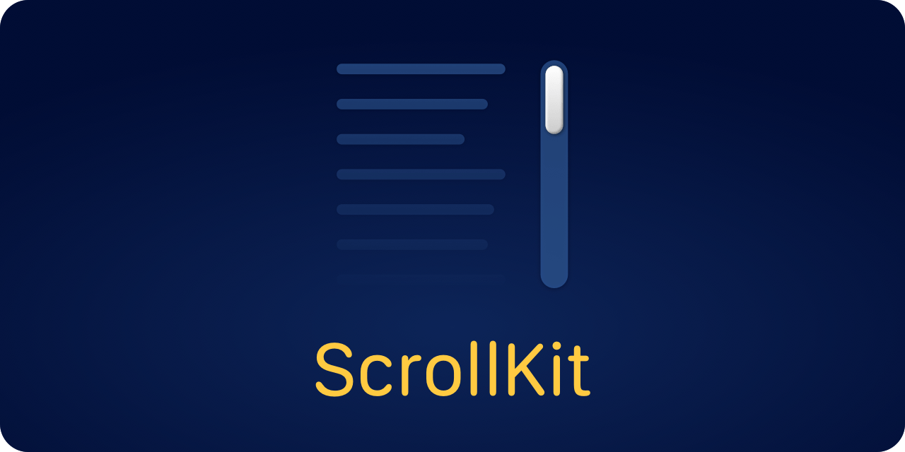

<p align="center">
    
</p>

<p align="center">
    
    
    
    
    <a href="https://twitter.com/danielsaidi"></a>
    <a href="https://mastodon.social/@danielsaidi"></a>
</p>


## About ScrollKit

ScrollKit is a SwiftUI SDK that adds powerful scroll features, like offset tracking and a header view that stretches & transforms as you pull down, and sticks to the top when you scroll.

The result can look like this, or completely different:

<p align="center" style="border-radius: 10px">
    
</p>

ScrollKit is designed to be easy to use and works on all major Apple platforms.


## Installation

ScrollKit can be installed with the Swift Package Manager:

```
https://github.com/danielsaidi/ScrollKit.git
```


## Getting started

ScrollKit has a `ScrollViewWithOffsetTracking` view that can detect scrolling:

```swift
ScrollViewWithOffsetTracking { offset in
    print(offset)
} content: {
    // Add your scroll content here, e.g. a `LazyVStack`
}
```

ScrollKit also has a `ScrollViewWithStickyHeader` that makes it easy to set up a stretchy, sticky header:

```swift
struct MyView: View {

    @State
    private var offset = CGPoint.zero
    
    @State
    private var visibleRatio = CGFloat.zero
    
    func handleOffset(_ scrollOffset: CGPoint, visibleHeaderRatio: CGFloat) {
        self.offset = scrollOffset
        self.visibleRatio = visibleHeaderRatio
    }
    
    func header() -> some View {
        ZStack(alignment: .bottomLeading) {
            Color.blue
            Color.yellow.opacity(visibleRatio)  // Fades in
        }
    }

    var body: some View {
        ScrollViewWithStickyHeader(
            header: header,
            headerHeight: 250,
            headerMinHeight: 150,
            onScroll: handleOffset
        ) {
            // Add your scroll content here, e.g. a `LazyVStack`
        }
    }
}
```

For more information, please see the [getting started guide][Getting-Started].


## Documentation

The [online documentation][Documentation] has more information, articles, code examples, etc.


## Demo Application

The demo app lets you explore the library. To try it out, just open and run the `Demo` project.


## Support my work

You can [sponsor me][Sponsors] on GitHub Sponsors or [reach out][Email] for paid support, to help support my [open-source projects][OpenSource].

Your support makes it possible for me to put more work into these projects and make them the best they can be.


## Contact

Feel free to reach out if you have questions or want to contribute in any way:

* Website: [danielsaidi.com][Website]
* Mastodon: [@danielsaidi@mastodon.social][Mastodon]
* Twitter: [@danielsaidi][Twitter]
* E-mail: [daniel.saidi@gmail.com][Email]


## License

ScrollKit is available under the MIT license. See the [LICENSE][License] file for more info.


[Email]: mailto:daniel.saidi@gmail.com

[Website]: https://danielsaidi.com
[GitHub]: https://github.com/danielsaidi
[Twitter]: https://twitter.com/danielsaidi
[Mastodon]: https://mastodon.social/@danielsaidi
[OpenSource]: https://danielsaidi.com/opensource
[Sponsors]: https://github.com/sponsors/danielsaidi

[Documentation]: https://danielsaidi.github.io/ScrollKit/
[Getting-Started]: https://danielsaidi.github.io/ScrollKit/documentation/scrollkit/getting-started

[License]: https://github.com/danielsaidi/ScrollKit/blob/master/LICENSE
