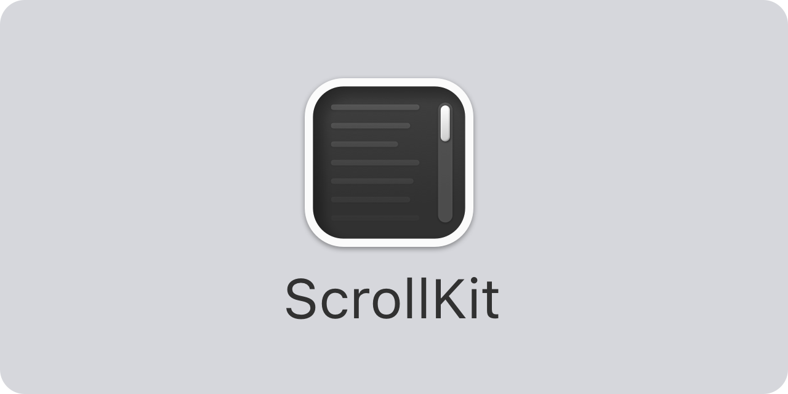
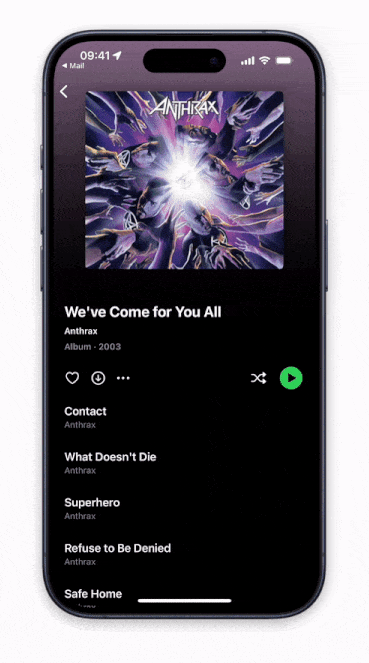

<p align="center">
    
</p>

<p align="center">
    
    
    
    
    
    
</p>


## About ScrollKit

ScrollKit is a SwiftUI library that adds powerful scrolling features to SwiftUI, such as scroll offset tracking and scroll view headers that stretch out as you pull down and stick to the top when you scroll.

The result can look like this, or completely different:

<p align="center" style="border-radius: 10px">
    
</p>

The views in this library are designed to be easy to use, and basically just add more properties to the standard SwiftUI `ScrollView`. They can be used on all Apple platforms, including iOS, macOS, tvOS and watchOS.


## Installation

ScrollKit can be installed with the Swift Package Manager:

```
https://github.com/danielsaidi/ScrollKit.git
```

or with CocoaPods:

```
pod DSScrollKit
```

If you prefer to not have external dependencies, you can also just copy the source code into your app.


## Supported Platforms

ScrollKit supports `iOS 14`, `macOS 11`, `tvOS 14` and `watchOS 7`.


## Getting started

The [online documentation][Documentation] has a [getting started guide][Getting-Started] guide to help you get started with ScrollKit.

To create a scroll view with a stretchable, sticky header, just create a `ScrollViewWithStickyHeader` and provide it with a header view and header height:

```swift
struct MyView: View {

    @State
    private var offset = CGPoint.zero
    
    @State
    private var visibleRatio = CGFloat.zero
    
    func handleOffset(_ scrollOffset: CGPoint, visibleHeaderRatio: CGFloat) {
        self.offset = scrollOffset
        self.visible = visibleHeaderRatio
    }
    
    func header() -> some View {
        ZStack(alignment: .bottomLeading) {
            Color.blue
            Color.yellow.opacity(visibleRatio)  // Fades in
        }
    }

    var body: some View {
        ScrollViewWithStickyHeader(
            header: header,
            headerHeight: 250,
            onScroll: handleOffset
        ) {
            // Add your scroll view content here as regular
        }
    }
}
```

The header visible ratio is based on the header height and scroll view offset and lets you adjust your content as the header is scrolled under the navigation bar, for instance to modify the header and fade in a navigation title.

For more information, please see the [online documentation][Documentation] and [getting started guide][Getting-Started] guide. 


## Documentation

The [online documentation][Documentation] contains more information, code examples, etc., and makes it easy to overview the various parts of the library.


## Demo Application

The demo app lets you explore the library on iOS and macOS. To try it out, just open and run the `Demo` project.


## Support

You can sponsor this project on [GitHub Sponsors][Sponsors] or get in touch for paid support. 


## Contact

Feel free to reach out if you have questions or if you want to contribute in any way:

* Website: [danielsaidi.com][Website]
* Mastodon: [@danielsaidi@mastodon.social][Mastodon]
* Twitter: [@danielsaidi][Twitter]
* E-mail: [daniel.saidi@gmail.com][Email]


## License

ScrollKit is available under the MIT license. See the [LICENSE][License] file for more info.


[Email]: mailto:daniel.saidi@gmail.com
[Website]: https://www.danielsaidi.com
[Twitter]: https://www.twitter.com/danielsaidi
[Mastodon]: https://mastodon.social/@danielsaidi
[Sponsors]: https://github.com/sponsors/danielsaidi

[Documentation]: https://danielsaidi.github.io/ScrollKit/documentation/scrollkit/
[Getting-Started]: https://danielsaidi.github.io/ScrollKit/documentation/scrollkit/getting-started
[License]: https://github.com/danielsaidi/ScrollKit/blob/master/LICENSE
