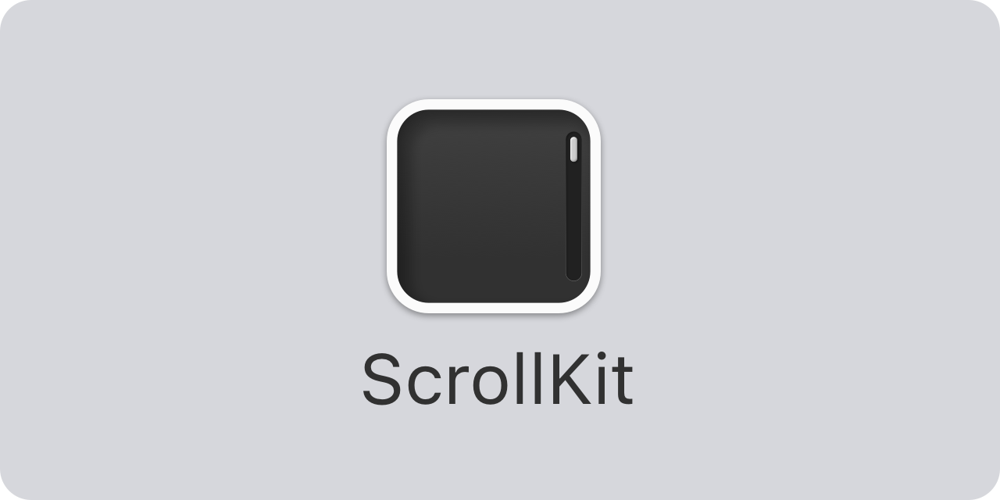

<p align="center">
    
</p>

<p align="center">
    
    
    
    
    <a href="https://twitter.com/danielsaidi"></a>
    <a href="https://mastodon.social/@danielsaidi"></a>
</p>


## About ScrollKit

ScrollKit adds powerful scrolling features to `SwiftUI`, like scroll offset tracking and a header view that stretches and transform as you pull down, then sticks to the top when you scroll.

The result can look like this, or completely different:

<p align="center" style="border-radius: 10px">
    
</p>

ScrollKit is designed to be easy to use and works on all major Apple platforms (iOS, macOS, tvOS and watchOS).


## Installation

ScrollKit can be installed with the Swift Package Manager:

```
https://github.com/danielsaidi/ScrollKit.git
```

If you prefer to not have external dependencies, you can also just copy the source code into your app.


## Getting started

The [online documentation][Documentation] has a [getting started guide][Getting-Started] guide to help you get started with ScrollKit.

You can use a `ScrollViewWithOffsetTracking` view to detect when the view scrolls:

```swift
ScrollViewWithOffsetTracking { offset in
    print(offset)
} content: {
    // Add your scroll content here, e.g. a `LazyVStack`
}
```

You can use this offset in any way you like, e.g. to fade in a navigation bar title.

You can use a `ScrollViewWithStickyHeader` to create a scroll view with a stretchy, sticky header:

```swift
struct MyView: View {

    @State
    private var offset = CGPoint.zero
    
    @State
    private var visibleRatio = CGFloat.zero
    
    func handleOffset(_ scrollOffset: CGPoint, visibleHeaderRatio: CGFloat) {
        self.offset = scrollOffset
        self.visibleRatio = visibleHeaderRatio
    }
    
    func header() -> some View {
        ZStack(alignment: .bottomLeading) {
            Color.blue
            Color.yellow.opacity(visibleRatio)  // Fades in
        }
    }

    var body: some View {
        ScrollViewWithStickyHeader(
            header: header,
            headerHeight: 250,
            headerMinHeight: 150,
            onScroll: handleOffset
        ) {
            // Add your scroll content here, e.g. a `LazyVStack`
        }
    }
}
```

The `visibleHeaderRatio` is how many percent (1.0 to 0.0) that is visible below the navigation bar.

For more information, please see the [online documentation][Documentation] and [getting started guide][Getting-Started] guide. 


## Documentation

The [online documentation][Documentation] has more information, code examples, etc.


## Demo Application

The demo app lets you explore the library on iOS and macOS. To try it out, just open and run the `Demo` project.


## Support my work

I manage many open-source projects on my spare time and am very thankful for any help to keep my work going. 

You can sponsor my work on [GitHub Sponsors][Sponsors] or get in touch for paid support.


## Contact

Feel free to reach out if you have questions or want to contribute in any way:

* Website: [danielsaidi.com][Website]
* Mastodon: [@danielsaidi@mastodon.social][Mastodon]
* Twitter: [@danielsaidi][Twitter]
* E-mail: [daniel.saidi@gmail.com][Email]


## License

ScrollKit is available under the MIT license. See the [LICENSE][License] file for more info.


[Email]: mailto:daniel.saidi@gmail.com
[Website]: https://www.danielsaidi.com
[Twitter]: https://www.twitter.com/danielsaidi
[Mastodon]: https://mastodon.social/@danielsaidi
[Sponsors]: https://github.com/sponsors/danielsaidi

[Documentation]: https://danielsaidi.github.io/ScrollKit/documentation/scrollkit/
[Getting-Started]: https://danielsaidi.github.io/ScrollKit/documentation/scrollkit/getting-started
[License]: https://github.com/danielsaidi/ScrollKit/blob/master/LICENSE
